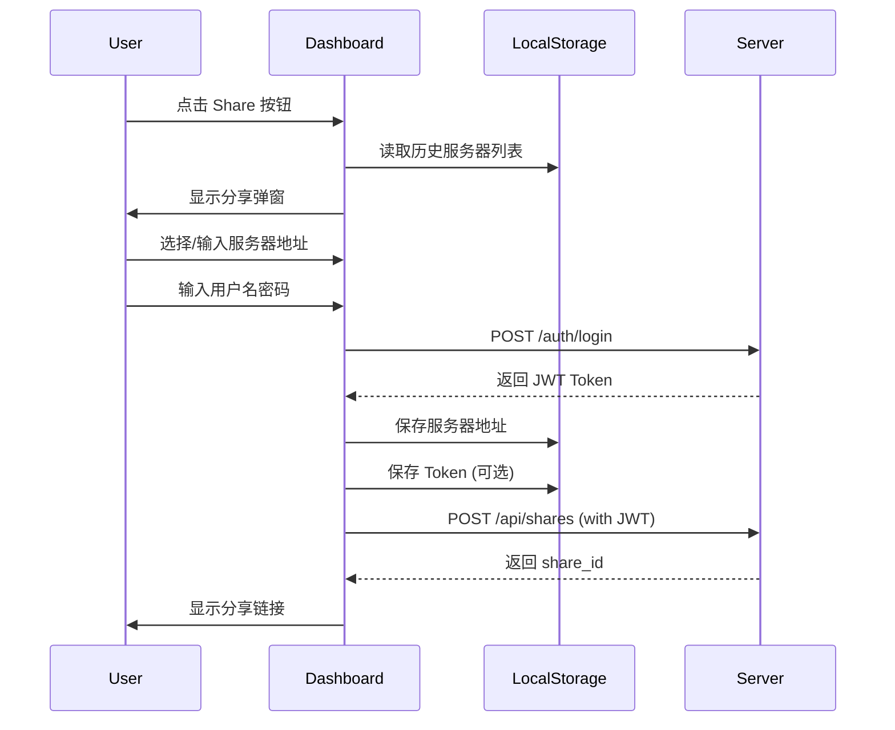
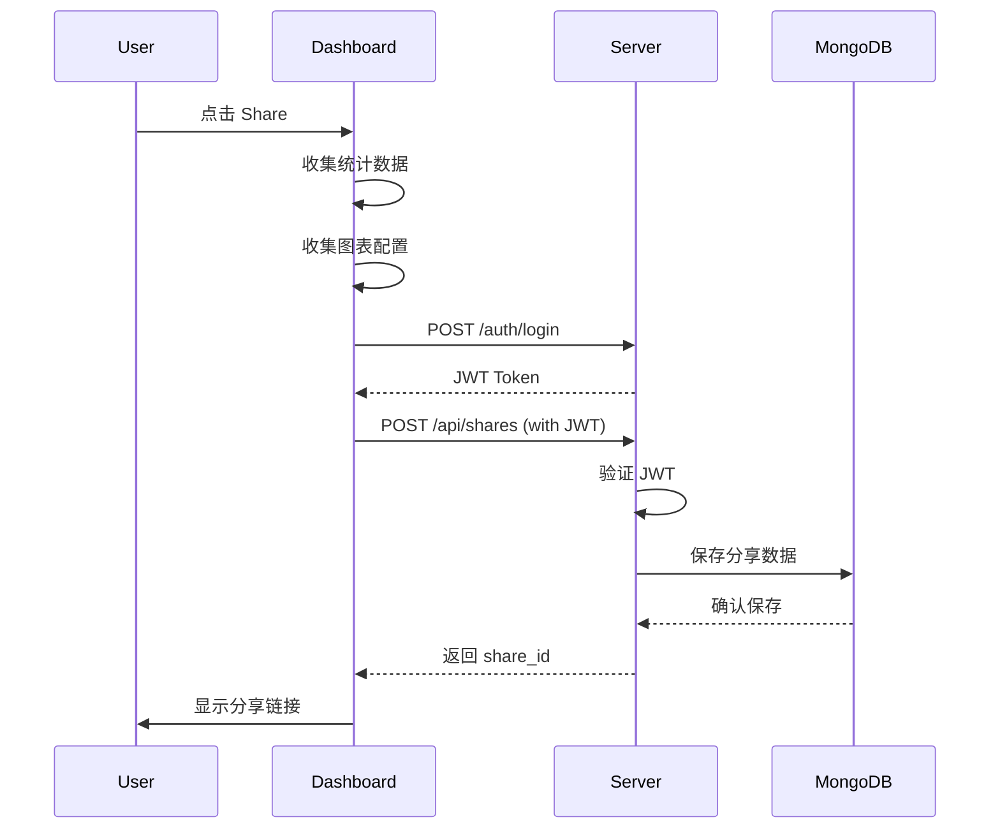
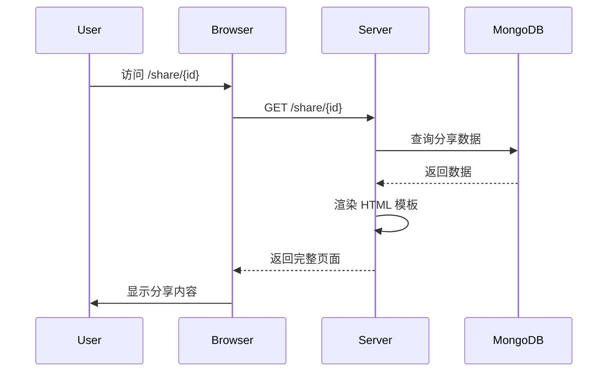

# 内网 Sniffly 分享系统设计文档

**日期**: 2026-03-30
**版本**: 1.0
**状态**: 待实施

---

## 1. 概述

### 1.1 目标

构建一个内网部署的 Sniffly 分享系统，使内网研发人员能够：
1. 通过 `pip install sniffly-iceleaf916` 安装工具
2. 将分析数据 share 到用户部署的内网服务器
3. 分享过程需要认证（用户名/密码）
4. 支持填写/选择服务器地址，并缓存历史地址

### 1.2 核心需求

| 需求 | 说明 |
|------|------|
| pip 安装 | 发布到私有 PyPI 或内部仓库 |
| 独立服务端 | 部署在内网服务器，支持 Docker Compose 单机部署 |
| 认证机制 | JWT Token 认证，支持登录弹窗 |
| 服务器地址管理 | 支持填写 IP:端口，缓存历史地址供下次选择 |

---

## 2. 系统架构

```mermaid
graph TB
    subgraph "客户端 (sniffly-iceleaf916)"
        A[Dashboard UI] --> B[Share Modal]
        B --> C[Server Selector]
        B --> D[Auth Handler]
        C --> E[LocalStorage<br/>缓存历史服务器]
        D --> F[Login Modal]
    end

    subgraph "服务端 (sniffly-server)"
        G[FastAPI App] --> H[Auth API<br/>POST /auth/login]
        G --> I[Share API<br/>POST /api/shares]
        G --> J[Gallery API<br/>GET /api/gallery]
        G --> K[Share Page<br/>GET /share/{id}]
    end

    subgraph "存储层"
        L[(MongoDB<br/>分享数据)]
        M[(Redis<br/>Session/Token)]
    end

    B -.->|HTTP API| G
    D -.->|JWT Token| G
    G --> L
    G --> M
```

---

## 3. 组件详细设计

### 3.1 客户端修改 (sniffly-iceleaf916)

#### 3.1.1 分享弹窗增强

**文件**: `sniffly/templates/dashboard.html`

新增服务器地址选择区域：

```
┌─────────────────────────────────────┐
│  Share Dashboard                    │
├─────────────────────────────────────┤
│  Server Address:                    │
│  ┌─────────────────────────────┐   │
│  │ http://10.0.1.100:8080   ▼ │   │  ← 下拉选择历史地址
│  └─────────────────────────────┘   │
│  [+ Add New Server]                 │
│                                     │
│  [✓] Include commands in share     │
│                                     │
│  ┌─────────────────────────────┐   │
│  │  Authenticate to Share      │   │
│  │  Username: [____________]   │   │
│  │  Password: [____________]   │   │
│  │         [Login & Share]     │   │
│  └─────────────────────────────┘   │
│                                     │
│  [Cancel]        [Share]            │
└─────────────────────────────────────┘
```

#### 3.1.2 认证流程



#### 3.1.3 LocalStorage 数据结构

```javascript
// 历史服务器地址
{
  "sniffly_servers": [
    {
      "url": "http://10.0.1.100:8080",
      "name": "研发内网服务器",
      "last_used": "2026-03-30T10:30:00Z"
    }
  ],
  // 按服务器存储的 token（可选，减少重复登录）
  "sniffly_tokens": {
    "http://10.0.1.100:8080": {
      "token": "eyJhbG...",
      "expires_at": "2026-03-30T12:00:00Z"
    }
  }
}
```

#### 3.1.4 修改的文件清单

| 文件 | 修改内容 |
|------|----------|
| `sniffly/templates/dashboard.html` | 新增分享弹窗 HTML 结构 |
| `sniffly/static/js/share-modal.js` | 分享逻辑、服务器选择、认证处理 |
| `sniffly/static/css/share-modal.css` | 分享弹窗样式 |
| `sniffly/share.py` | 修改 `_upload_via_api()` 支持 JWT 认证 |

### 3.2 服务端设计 (sniffly-server)

#### 3.2.1 技术栈

- **框架**: FastAPI (Python)
- **数据库**: MongoDB (存储分享数据)
- **缓存**: Redis (存储 session/token)
- **部署**: Docker Compose

#### 3.2.2 API 设计

**认证接口**

```http
POST /auth/login
Content-Type: application/json

{
  "username": "string",
  "password": "string"
}

Response 200:
{
  "access_token": "eyJhbG...",
  "token_type": "bearer",
  "expires_in": 3600
}
```

**创建分享接口**

```http
POST /api/shares
Authorization: Bearer {token}
Content-Type: application/json

{
  "share_id": "uuid",
  "data": {
    "statistics": {},
    "charts": [],
    "user_commands": [],
    "version": "0.1.5",
    "is_public": false,
    "project_name": "string"
  }
}

Response 201:
{
  "url": "http://server/share/{share_id}",
  "share_id": "uuid"
}
```

**画廊列表接口**

```http
GET /api/gallery?page=1&limit=20

Response 200:
{
  "projects": [
    {
      "id": "uuid",
      "title": "string",
      "project_name": "string",
      "created_at": "2026-03-30T10:30:00Z",
      "stats": {
        "total_commands": 100,
        "total_tokens": 50000,
        "duration_days": 7
      }
    }
  ],
  "total": 100
}
```

**分享页面接口**

```http
GET /share/{share_id}

Response 200: HTML 页面（服务端渲染）
```

#### 3.2.3 数据模型

**MongoDB Collections**

```javascript
// shares 集合
{
  "_id": "uuid",
  "created_at": "2026-03-30T10:30:00Z",
  "statistics": {},
  "charts": [],
  "user_commands": [],
  "version": "0.1.5",
  "is_public": false,
  "project_name": "string",
  "created_by": "username",  // 记录创建者
  "expires_at": null  // 可选：过期时间
}

// users 集合（简单内置账号）
{
  "_id": "uuid",
  "username": "admin",
  "password_hash": "bcrypt_hash",
  "created_at": "2026-03-30T10:30:00Z"
}
```

### 3.3 Docker Compose 部署配置

```yaml
# docker-compose.yml
version: '3.8'

services:
  app:
    image: sniffly-server:latest
    ports:
      - "8080:8080"
    environment:
      - MONGODB_URL=mongodb://mongo:27017/sniffly
      - REDIS_URL=redis://redis:6379
      - JWT_SECRET=${JWT_SECRET}
      - ADMIN_USERNAME=${ADMIN_USERNAME:-admin}
      - ADMIN_PASSWORD=${ADMIN_PASSWORD}
    depends_on:
      - mongo
      - redis

  mongo:
    image: mongo:7
    volumes:
      - mongo_data:/data/db

  redis:
    image: redis:7-alpine
    volumes:
      - redis_data:/data

volumes:
  mongo_data:
  redis_data:
```

---

## 4. 数据流

### 4.1 分享创建流程



### 4.2 分享查看流程



---

## 5. 安全考虑

| 方面 | 措施 |
|------|------|
| 认证 | JWT Token，设置合理过期时间 |
| 密码 | bcrypt 哈希存储 |
| 传输 | 内网环境，可选 HTTPS |
| 数据清理 | 支持设置分享过期时间 |
| 敏感信息 | 客户端 `_sanitize_statistics()` 移除文件路径 |

---

## 6. 错误处理

| 场景 | 处理 |
|------|------|
| 认证失败 | 显示登录弹窗，提示重新输入 |
| 服务器不可达 | 提示检查服务器地址 |
| Token 过期 | 自动刷新或提示重新登录 |
| 分享创建失败 | 显示错误信息，支持重试 |

---

## 7. 实施计划概要

### Phase 1: 服务端开发
1. FastAPI 项目脚手架
2. MongoDB & Redis 集成
3. 认证 API 实现
4. 分享 CRUD API 实现
5. 分享页面渲染

### Phase 2: 客户端修改
1. 分享弹窗 UI 改造
2. 服务器地址管理（LocalStorage）
3. 认证流程集成
4. API 调用改造

### Phase 3: 部署
1. Dockerfile 编写
2. Docker Compose 配置
3. 部署文档编写

---

## 8. 附录

### 8.1 目录结构

```
sniffly-server/
├── app/
│   ├── __init__.py
│   ├── main.py           # FastAPI 入口
│   ├── config.py         # 配置管理
│   ├── auth.py           # 认证相关
│   ├── models.py         # 数据模型
│   ├── database.py       # 数据库连接
│   └── routers/
│       ├── auth.py       # 认证路由
│       ├── shares.py     # 分享路由
│       └── gallery.py    # 画廊路由
├── templates/
│   └── share.html        # 分享页面模板
├── static/
│   └── css/
│       └── share.css
├── Dockerfile
├── docker-compose.yml
└── requirements.txt
```

### 8.2 依赖清单

**服务端**
- fastapi
- uvicorn
- motor (MongoDB async driver)
- redis
- pyjwt
- bcrypt
- jinja2

**客户端（新增）**
- 无新增依赖，使用原生 fetch API
