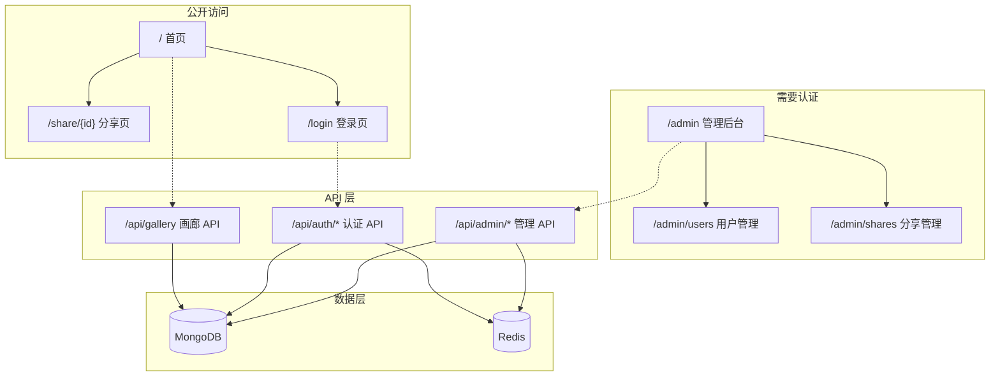

# Sniffly Server 管理后台和首页设计文档

**日期**: 2026-03-31
**版本**: 1.0
**状态**: 待实施

---

## 1. 概述

### 1.1 目标

为 sniffly-server 增加管理后台和首页功能：

1. **首页**：混合模式 - 公开展示公开分享，用户登录后访问个人/管理页面
2. **管理后台**：admin 用户管理（创建、删除、修改密码、启用/禁用）
3. **参考风格**：参考 sniffly.dev 的简洁设计

### 1.2 设计原则

- 与现有 FastAPI + Jinja2 技术栈保持一致
- 简洁优先，避免引入新的构建工具或前端框架
- 管理员手动创建账号，不支持自注册

---

## 2. 系统架构



---

## 3. 路由设计

### 3.1 公开路由

| 路由 | 方法 | 说明 |
|------|------|------|
| `/` | GET | 首页，展示公开分享画廊 |
| `/login` | GET | 登录页面 |
| `/login` | POST | 处理登录请求 |
| `/share/{share_id}` | GET | 分享详情页（保持现有功能） |

### 3.2 管理后台路由

| 路由 | 方法 | 说明 | 权限 |
|------|------|------|------|
| `/admin` | GET | 管理后台首页 | admin |
| `/admin/users` | GET | 用户管理页面 | admin |
| `/admin/shares` | GET | 分享管理页面 | admin |

### 3.3 API 路由

#### 认证 API（保持现有）
| 路由 | 方法 | 说明 |
|------|------|------|
| `/auth/login` | POST | 登录 |
| `/auth/logout` | POST | 登出 |

#### 管理 API（新增）
| 路由 | 方法 | 说明 |
|------|------|------|
| `/api/admin/users` | GET | 获取用户列表 |
| `/api/admin/users` | POST | 创建用户 |
| `/api/admin/users/{username}` | GET | 获取用户详情 |
| `/api/admin/users/{username}` | PUT | 更新用户（密码、启用状态） |
| `/api/admin/users/{username}` | DELETE | 删除用户 |
| `/api/admin/shares` | GET | 获取分享列表 |
| `/api/admin/shares/{share_id}` | DELETE | 删除分享 |
| `/api/admin/stats` | GET | 获取系统统计 |

---

## 4. 页面设计

### 4.1 首页 (`/`)

参考 sniffly.dev 的简洁风格：

```
┌────────────────────────────────────────────────────────────────┐
│  [Logo]  Sniffly Server              [Login]  [GitHub]         │
├────────────────────────────────────────────────────────────────┤
│                                                                │
│  Internal Claude Code Analytics                                │
│  ──────────────────────────                                    │
│  Track and share your Claude Code usage insights               │
│                                                                │
├────────────────────────────────────────────────────────────────┤
│  Public Dashboard Gallery                                      │
│  ────────────────────────                                      │
│                                                                │
│  ┌──────────────┐  ┌──────────────┐  ┌──────────────┐        │
│  │ Project A    │  │ Project B    │  │ Project C    │        │
│  │ by user1     │  │ by user2     │  │ by user3     │        │
│  │ 2026-03-30   │  │ 2026-03-29   │  │ 2026-03-28   │        │
│  └──────────────┘  └──────────────┘  └──────────────┘        │
│                                                                │
├────────────────────────────────────────────────────────────────┤
│  © 2026 Sniffly Server                                        │
└────────────────────────────────────────────────────────────────┘
```

### 4.2 登录页 (`/login`)

```
┌────────────────────────────────────────────────────────────────┐
│  [Logo]  Sniffly Server                                        │
├────────────────────────────────────────────────────────────────┤
│                                                                │
│                    Sign In                                     │
│                    ─────                                      │
│                                                                │
│                    Username                                   │
│                    ┌─────────────────────────┐                │
│                    │                         │                │
│                    └─────────────────────────┘                │
│                                                                │
│                    Password                                   │
│                    ┌─────────────────────────┐                │
│                    │                         │                │
│                    └─────────────────────────┘                │
│                                                                │
│                    [        Sign In        ]                  │
│                                                                │
│                    {{ error_message }}                          │
│                                                                │
├────────────────────────────────────────────────────────────────┤
│  © 2026 Sniffly Server                                        │
└────────────────────────────────────────────────────────────────┘
```

### 4.3 管理后台首页 (`/admin`)

```
┌────────────────────────────────────────────────────────────────┐
│  [Logo]  Admin Dashboard                    [退出]             │
├──────────────┬─────────────────────────────────────────────────┤
│              │                                                 │
│  📊 概览     │  系统概览                                       │
│              │  ────────                                       │
│  👥 用户管理 │                                                 │
│              │  ┌───────────┐ ┌───────────┐ ┌───────────┐     │
│  📁 分享管理 │  │ 用户数    │ │ 分享数    │ │ 公开分享数│     │
│              │  │    12     │ │   156     │ │    23     │     │
│  ⚙️ 设置    │  └───────────┘ └───────────┘ └───────────┘     │
│              │                                                 │
│              │  最近分享                                        │
│              │  ────────                                       │
│              │  ┌─────────────────────────────────────────┐   │
│              │  │ Project A  | user1 | 2026-03-30 | 查看  │   │
│              │  │ Project B  | user2 | 2026-03-29 | 查看  │   │
│              │  └─────────────────────────────────────────┘   │
│              │                                                 │
└──────────────┴─────────────────────────────────────────────────┘
```

### 4.4 用户管理页面 (`/admin/users`)

```
┌────────────────────────────────────────────────────────────────┐
│  [Logo]  Admin Dashboard                    [退出]             │
├──────────────┬─────────────────────────────────────────────────┤
│              │                                                 │
│  📊 概览     │  用户管理                                        │
│              │  ────────                                       │
│  👥 用户管理 │  [+ 创建用户]                                    │
│              │                                                 │
│  📁 分享管理 │  ┌─────────────────────────────────────────┐   │
│              │  │ 用户名      │ 创建时间     │ 操作         │   │
│  ⚙️ 设置    │  ├─────────────────────────────────────────┤   │
│              │  │ admin      │ 2026-03-30  │ 编辑 | 删除   │   │
│              │  │ user1      │ 2026-03-29  │ 编辑 | 删除   │   │
│              │  │ user2      │ 2026-03-28  │ 编辑 | 删除   │   │
│              │  └─────────────────────────────────────────┘   │
│              │                                                 │
│              │  [分页: < 1 2 3 >]                             │
│              │                                                 │
└──────────────┴─────────────────────────────────────────────────┘
```

### 4.5 创建/编辑用户弹窗

```
┌─────────────────────────────────────┐
│  创建用户                      [X]  │
├─────────────────────────────────────┤
│                                     │
│  用户名                             │
│  ┌─────────────────────────────┐   │
│  │                             │   │
│  └─────────────────────────────┘   │
│                                     │
│  密码 (留空则不修改)                │
│  ┌─────────────────────────────┐   │
│  │                             │   │
│  └─────────────────────────────┘   │
│                                     │
│  ☑ 启用账号                         │
│                                     │
│  [取消]              [保存]          │
│                                     │
└─────────────────────────────────────┘
```

---

## 5. API 设计

### 5.1 创建用户

```http
POST /api/admin/users
Authorization: Bearer {admin_token}
Content-Type: application/json

{
  "username": "newuser",
  "password": "password123",
  "is_active": true
}

Response 201:
{
  "username": "newuser",
  "created_at": "2026-03-31T10:00:00Z",
  "is_active": true
}
```

### 5.2 获取用户列表

```http
GET /api/admin/users?page=1&limit=20
Authorization: Bearer {admin_token}

Response 200:
{
  "users": [
    {
      "username": "admin",
      "created_at": "2026-03-30T10:00:00Z",
      "is_active": true,
      "share_count": 10
    }
  ],
  "total": 12,
  "page": 1,
  "limit": 20
}
```

### 5.3 更新用户

```http
PUT /api/admin/users/{username}
Authorization: Bearer {admin_token}
Content-Type: application/json

{
  "password": "newpassword",  // 可选
  "is_active": false          // 可选
}

Response 200:
{
  "username": "user1",
  "created_at": "2026-03-29T10:00:00Z",
  "is_active": false
}
```

### 5.4 删除用户

```http
DELETE /api/admin/users/{username}
Authorization: Bearer {admin_token}

Response 204: No Content
```

### 5.5 获取分享列表

```http
GET /api/admin/shares?page=1&limit=20
Authorization: Bearer {admin_token}

Response 200:
{
  "shares": [
    {
      "id": "abc123",
      "project_name": "Project A",
      "created_by": "user1",
      "created_at": "2026-03-30T10:00:00Z",
      "is_public": true
    }
  ],
  "total": 156,
  "page": 1,
  "limit": 20
}
```

### 5.6 删除分享

```http
DELETE /api/admin/shares/{share_id}
Authorization: Bearer {admin_token}

Response 204: No Content
```

### 5.7 系统统计

```http
GET /api/admin/stats
Authorization: Bearer {admin_token}

Response 200:
{
  "total_users": 12,
  "active_users": 10,
  "total_shares": 156,
  "public_shares": 23,
  "recent_shares": [
    {
      "id": "abc123",
      "project_name": "Project A",
      "created_by": "user1",
      "created_at": "2026-03-30T10:00:00Z"
    }
  ]
}
```

---

## 6. 数据模型

### 6.1 User 模型扩展

```python
class User:
    username: str          # 主键
    password_hash: str     # bcrypt 哈希
    created_at: datetime   # 创建时间
    is_active: bool = True # 是否启用
    is_admin: bool = False # 是否管理员
```

### 6.2 MongoDB 索引

```python
# users 集合
db.users.create_index("username", unique=True)

# shares 集合（已有）
db.shares.create_index("created_at")
db.shares.create_index("is_public")
```

---

## 7. 权限控制

### 7.1 角色定义

| 角色 | 权限 |
|------|------|
| admin | 所有管理 API、用户管理、分享管理 |
| user | 创建分享、查看自己的分享、修改自己的密码 |

### 7.2 权限检查装饰器

```python
def require_admin(current_user: str = Depends(get_current_user)):
    """检查当前用户是否为管理员"""
    if current_user != settings.admin_username:
        raise HTTPException(status_code=403, detail="Admin access required")
    return current_user
```

---

## 8. 模板文件

### 8.1 新增模板

| 文件 | 说明 |
|------|------|
| `templates/index.html` | 首页 |
| `templates/login.html` | 登录页 |
| `templates/admin/layout.html` | 管理后台布局模板 |
| `templates/admin/index.html` | 管理后台首页 |
| `templates/admin/users.html` | 用户管理页面 |
| `templates/admin/shares.html` | 分享管理页面 |
| `templates/components/modal.html` | 通用弹窗组件 |

### 8.2 新增静态文件

| 文件 | 说明 |
|------|------|
| `static/css/admin.css` | 管理后台样式 |
| `static/js/admin.js` | 管理后台 JavaScript |
| `static/images/logo.png` | Logo 图片 |

---

## 9. 目录结构

```
sniffly-server/
├── app/
│   ├── main.py              # 扩展：新增首页、登录、管理路由
│   ├── auth.py              # 扩展：添加 require_admin 装饰器
│   ├── models.py            # 扩展：添加管理相关模型
│   └── routers/
│       ├── admin.py         # 新增：管理后台 API 路由
│       └── __init__.py      # 更新：导出 admin router
├── templates/
│   ├── index.html           # 新增：首页
│   ├── login.html           # 新增：登录页
│   ├── admin/               # 新增：管理后台模板
│   │   ├── layout.html
│   │   ├── index.html
│   │   ├── users.html
│   │   └── shares.html
│   ├── components/          # 新增：通用组件
│   │   └── modal.html
│   └── share.html           # 已有
├── static/
│   ├── css/
│   │   ├── admin.css        # 新增：管理后台样式
│   │   └── share.css        # 已有
│   └── js/
│       └── admin.js         # 新增：管理后台 JS
└── requirements.txt         # 更新（可选：添加 python-multipart）
```

---

## 10. 错误处理

| 场景 | HTTP 状态码 | 响应 |
|------|-------------|------|
| 未登录 | 401 | `{"detail": "Not authenticated"}` |
| 非管理员访问管理 API | 403 | `{"detail": "Admin access required"}` |
| 用户名已存在 | 409 | `{"detail": "Username already exists"}` |
| 用户不存在 | 404 | `{"detail": "User not found"}` |
| 无法删除最后一个管理员 | 400 | `{"detail": "Cannot delete the last admin user"}` |
| 无效输入 | 422 | Pydantic 验证错误 |

---

## 11. 安全考虑

1. **CSRF 保护**：登录表单使用 Session 或 CSRF Token
2. **密码强度**：建议最少 8 字符（可配置）
3. **登录限制**：同一 IP 5 分钟内最多 5 次失败登录
4. **会话管理**：JWT Token 有效期 24 小时，刷新机制可选
5. **审计日志**：记录管理员操作（创建/删除用户等）

---

## 12. 待办事项

- [ ] 实施计划待制定
